# Cloud-Migration-Security-Implementation-using-AWS
Secure AWS cloud infrastructure for a UK retail business — VPC, EC2, RDS, S3, IAM &amp; CloudWatch. Mapped to NIST CSF, AWS Well-Architected Framework &amp; UK GDPR.

# ☁️ Cloud Migration & Security Implementation using AWS
### FreshMart Case Study | Module: LD7081 – Big Data & Cloud Security

---

## 📋 Project Overview

This project demonstrates the design and implementation of a secure, cloud-based Big Data platform for **FreshMart (FM)**, a fictional UK supermarket chain, built entirely on **Amazon Web Services (AWS)**.

FreshMart previously operated fragmented per-store databases with overnight-only synchronisation — causing inventory inaccuracies, delayed decision-making, and recurring customer-facing outages. This project migrates that infrastructure to a unified, secure, and scalable AWS architecture across three phases.

---

## 🏗️ Architecture Overview

A **two-tier VPC architecture** was implemented: a public subnet hosting internet-facing resources and a private subnet containing the database — ensuring defence-in-depth and network isolation.

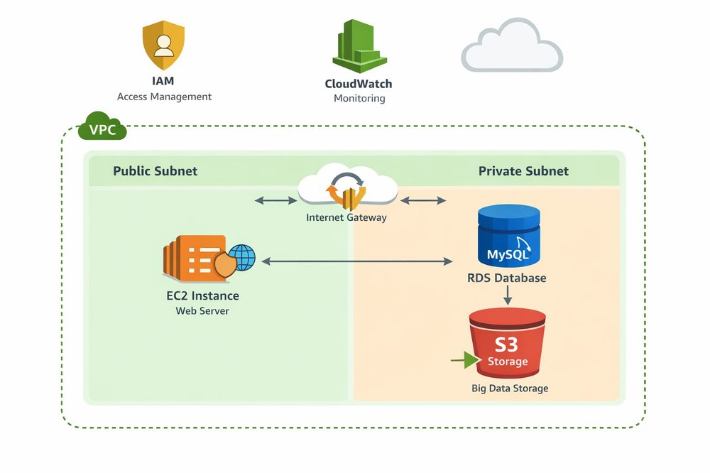
*Figure 1: AWS architecture diagram — two-tier VPC deployment*
## ⚙️ Phase 1: Migration – Web Application & Data Layer

### 1.1 VPC & Network Setup
VPC created with CIDR `10.0.0.0/16`, with public (`10.0.1.0/24`) and private (`10.0.2.0/24`) subnets. Internet Gateway attached with route table directing public traffic only — the private subnet has no internet route, making it unreachable from outside by design.

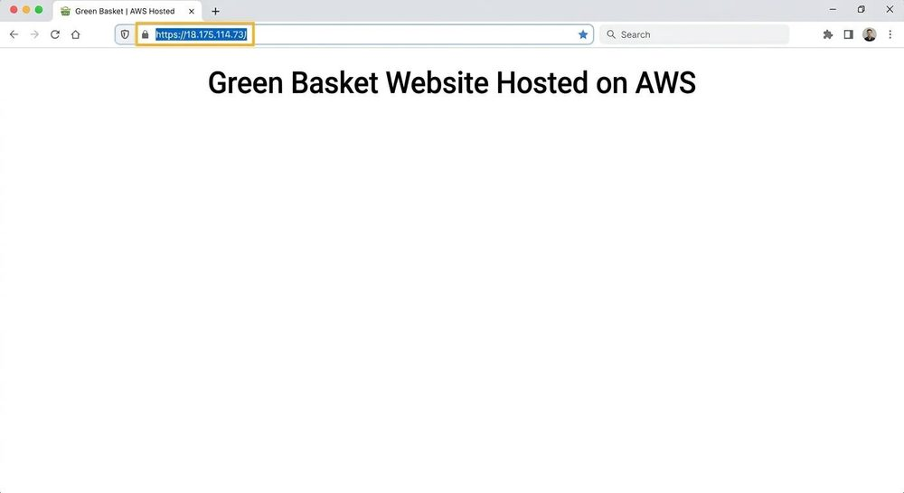
*Figure 2: VPC Created*

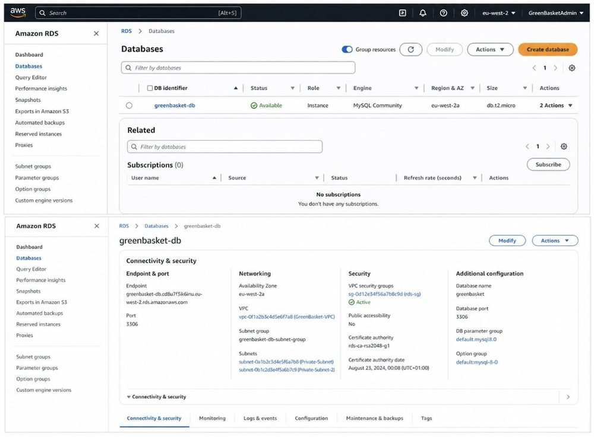
*Figure 3: Public and Private Subnets*

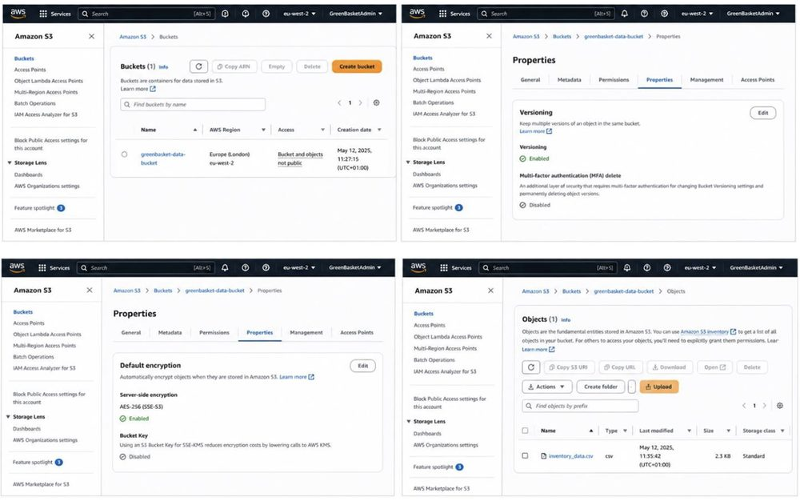
*Figure 4: Internet Gateway Attached*

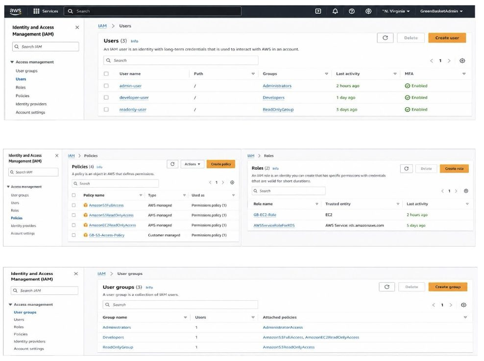
*Figure 5: Route Table Configuration*

---

### 1.2 Subnet Configuration
Public subnet configured for auto-assign public IPv4. Private subnet configured without public IP — **secure by default**, preventing accidental internet exposure.
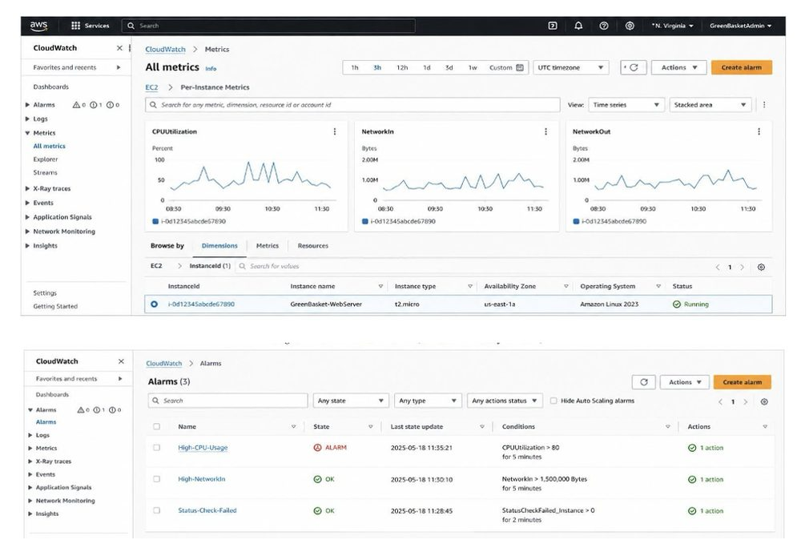
*Figure 6: Public subnet settings*

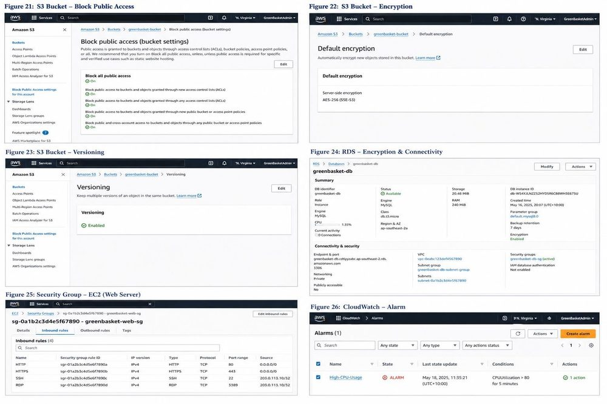
*Figure 7: Private subnet settings*

---

### 1.3 EC2 Instance (Web Server)
`t2.micro` EC2 instance launched in public subnet running **Apache HTTP Server**. Security group permits only TCP 22 (SSH, source-restricted), TCP 80, and TCP 443.

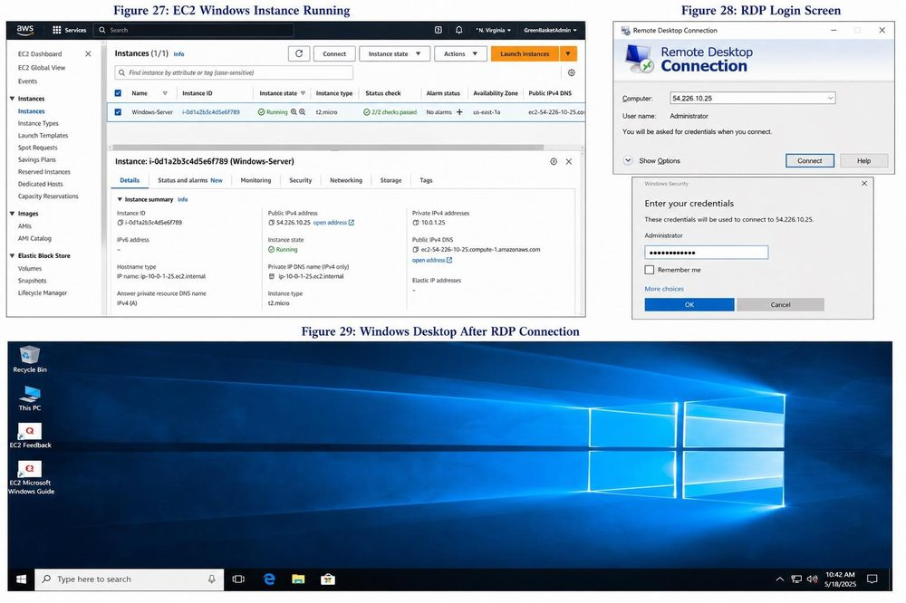
*Figure 8: EC2 instance running*

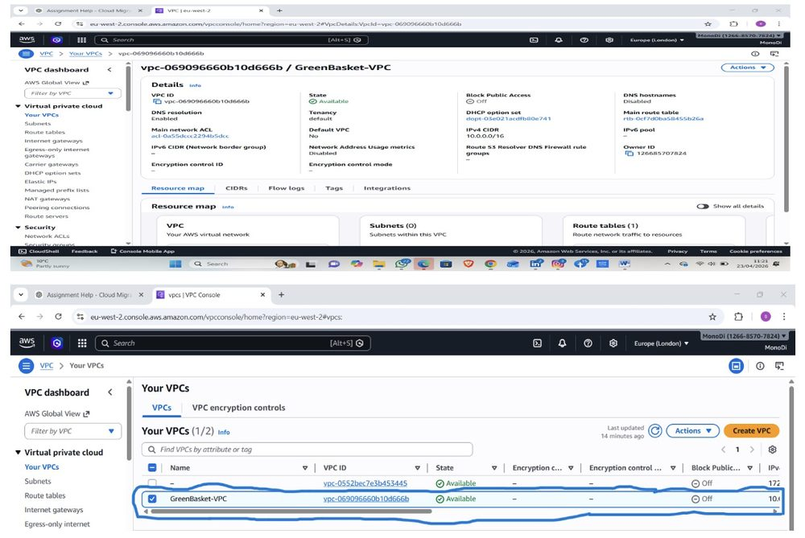
*Figure 9: Security group rules*

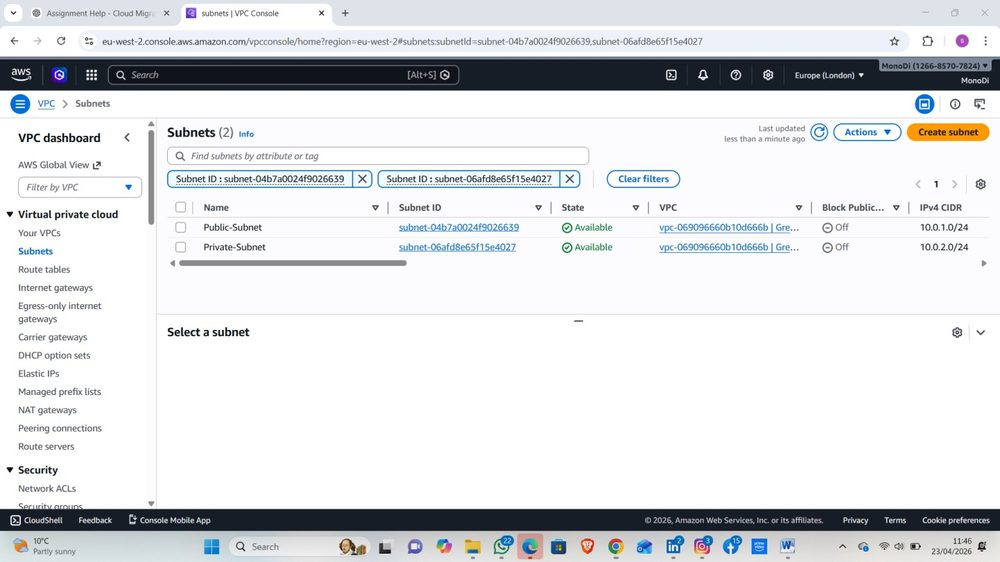
*Figure 10: Website live in browser*

---

### 1.4 RDS Database
Amazon RDS MySQL deployed in **private subnet**. Publicly Accessible: disabled. Encryption at rest enabled. Security group restricts access to web tier only (TCP 3306).

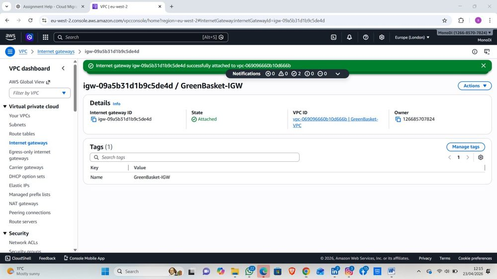
*Figure 11: RDS database configuration*

---
### 1.5 Amazon S3 – Big Data Storage
S3 bucket configured as the Big Data layer: **Block Public Access** enabled, **AES-256 encryption**, **versioning** active for ransomware protection.

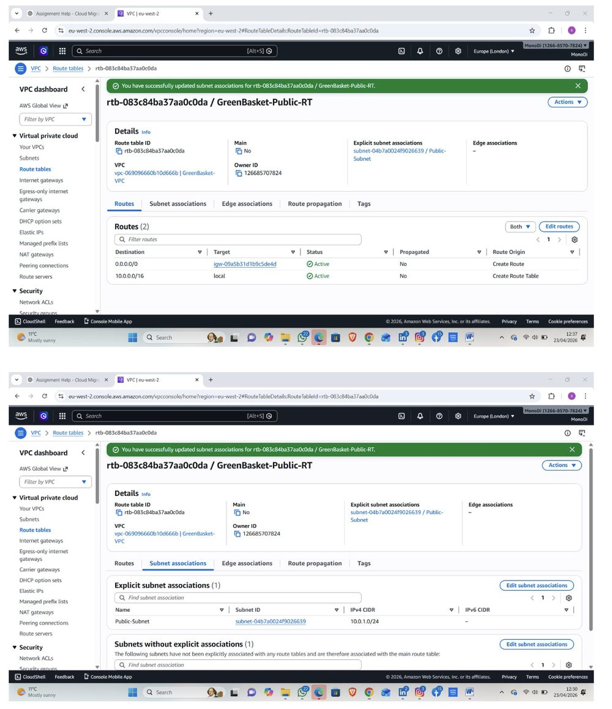
*Figure 12: S3 bucket — versioning, encryption & file upload*

---

### 1.6 IAM – Access Control
Least-privilege IAM users, groups (Administrators, Developers, ReadOnly) and roles implemented. EC2 accesses S3 via **instance profile role** — no long-lived access keys.

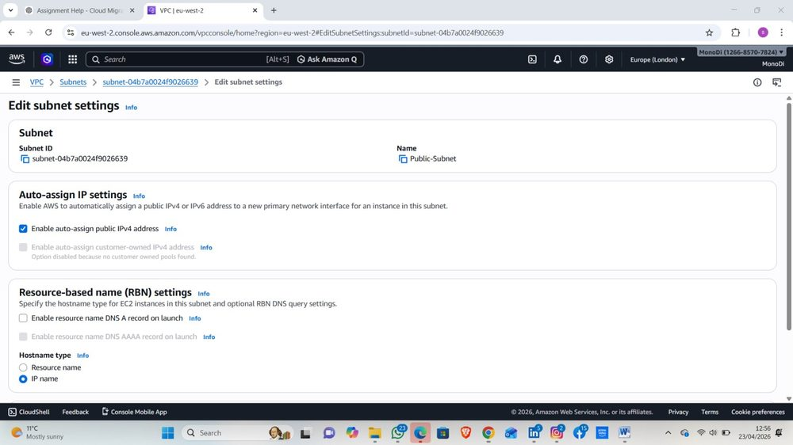
*Figure 13: IAM users, groups, policies & roles*

---

### 1.7 CloudWatch – Monitoring
CloudWatch collects metrics at 1-minute resolution. Alarms trigger **SNS notifications** on anomalous behaviour, enabling proactive detection of outages and security events.
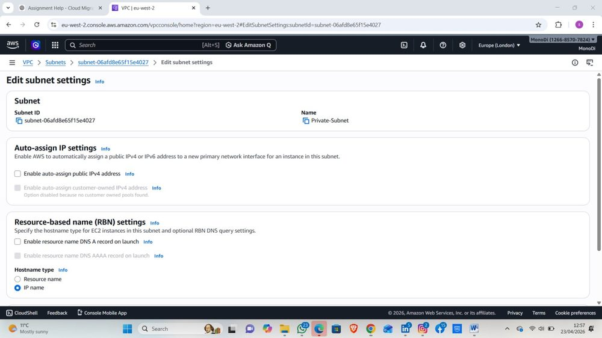
*Figure 14: CloudWatch monitoring dashboard*

---

## 🔐 Phase 2: Security Controls (CIA Triad)

| Principle | Controls Implemented |
|-----------|---------------------|
| **Confidentiality** | IAM least privilege + S3 Block Public Access + RDS encryption at rest (UK GDPR Article 32) |
| **Integrity** | S3 versioning + RDS point-in-time recovery + write-restricted IAM policies |
| **Availability** | S3 eleven-nines durability + CloudWatch proactive alerting |
| **Network Security** | Default-deny security groups + VPC routing isolation |

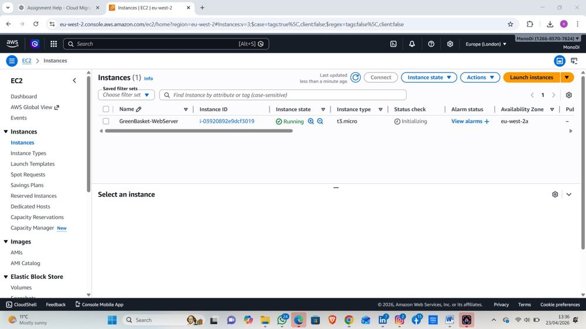
*Figure 15: AWS infrastructure — network & security configuration*

---

## 🖥️ Phase 3: Secure Remote Administration (RDP)

Windows Server EC2 launched in public subnet. RDP (TCP 3389) restricted to single administrator IP. **Network Level Authentication (NLA)** enforced. TLS-encrypted session. OS fully patched before deployment.

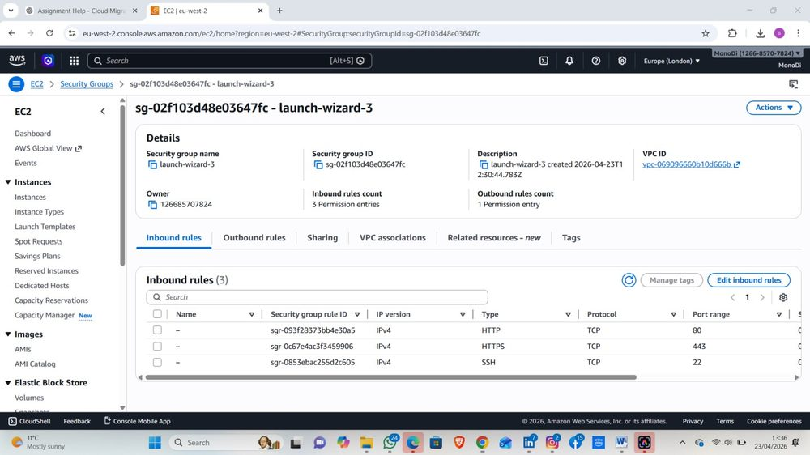
*Figure 16: Windows Server EC2 — secure RDP connection verified*

---

## 🛠️ Tools & Technologies

| Tool / Technology | Role | Purpose |
|-------------------|------|---------|
| Amazon VPC | Virtual networking | Isolated, segmented network topology |
| Amazon EC2 | Compute layer | Web server & Windows admin host |
| Amazon S3 | Big Data storage | Versioned, encrypted object store |
| Amazon RDS MySQL | Managed database | Private, encrypted, auto-backup |
| AWS IAM | Access control | Least-privilege identity management |
| Amazon CloudWatch | Monitoring | Metrics, logs & alarm alerting |
| Apache HTTP Server | Web server | Hosts the migrated web application |
| Microsoft RDP | Remote admin | Secure encrypted desktop access |

---

## 🔒 Security Frameworks Applied

- ✅ **AWS Well-Architected Framework** — Security, Reliability & Performance pillars
- ✅ **NIST Cybersecurity Framework (CSF) 2.0** — Identify, Protect, Detect, Respond, Recover
- ✅ **STRIDE Threat Model** — Spoofing, Tampering, Repudiation, Info Disclosure, DoS, Elevation
- ✅ **UK GDPR / Data Protection Act 2018** — Article 32 technical measures
- ✅ **ISO/IEC 27001:2022** — Access control & key management alignment

---

## 📈 Production Roadmap

- [ ] Multi-AZ EC2 deployment behind an Application Load Balancer
- [ ] RDS Multi-AZ with synchronous standby and automatic failover
- [ ] AWS Glue + Amazon Athena + QuickSight for analytics layer
- [ ] Replace IP-restricted RDP with AWS Systems Manager Session Manager
- [ ] AWS GuardDuty for continuous threat detection
- [ ] AWS Config for infrastructure drift detection
- [ ] AWS CloudTrail for tamper-evident audit logging
- [ ] Customer-managed KMS keys

---

## ✅ Conclusion

This project successfully delivered a secure, scalable AWS cloud platform for FreshMart — migrating fragmented per-store infrastructure to a unified architecture with layered security controls across identity, network, data, and monitoring layers. All implementation phases were verified with screenshots and mapped to industry security frameworks.

---

## 📫 Connect

---
*FreshMart is a fictional organisation used as a case study for academic purposes.*

